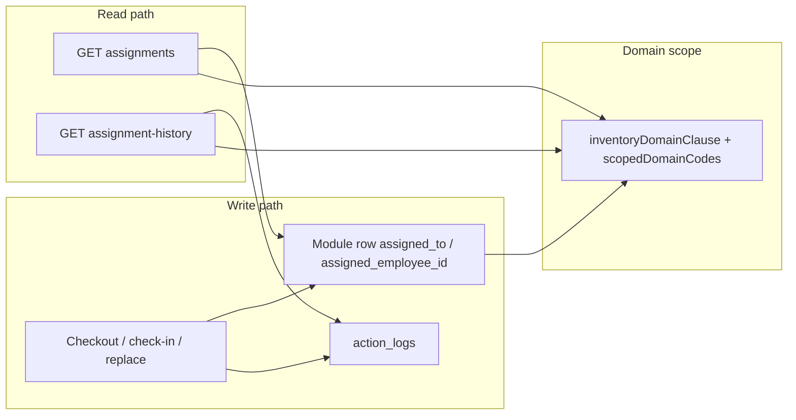

# WAVE 3.1 — Post-Implementation Audit

**Scope:** Domain RBAC + People unified assignments + Space Management  
**Mode:** Read-only. No code, schema, test, or data changes.  
**Live database inspected:** `ITAssetManagement_2026` (SELECT only)  
**Date:** 2026-08-24

---

## 1. Executive Summary

The pivot to a shared Asset Management system with **IT** and **ADMIN** domains is **architecturally sound on the primary inventory path**. Domain is a real `domain_id` FK on all five inventory tables. List, detail, create, update, delete, checkout, check-in, and replace for Assets / Licenses / Accessories / Consumables / Components enforce domain in **SQL and record-level 403s**, not only in the UI.

**Live inventory classification (deleted_at IS NULL):**

| Table | IT | ADMIN | NULL domain |
|---|---|---|---|
| assets | **1204** | 0 | **0** |
| licenses | 15 | 0 | 0 |
| accessories | 15 | 0 | 0 |
| consumables | 15 | 0 | 0 |
| components | 15 | 0 | 0 |

Legacy ITAM rows were backfilled to IT (039) and remain visible to IT / Super Admin / application Admin. They are **invisible to Admin Asset Manager**, which is intended.

Space Management correctly reuses `locations` + Wave 2 `FLOOR` / `SPACE` types. It does **not** yet have production office/floor/space rows (`is_office=0` on all 187 live locations; 0 FLOOR; 0 SPACE). Placement still uses `assets.location_id` / `rtd_location_id`. Custody still uses `assigned_to`. Those two axes do not collide.

**It is not yet airtight.** Several **secondary** authenticated endpoints return or mutate inventory **without** `inventoryDomainClause` / `assertRecordDomainAccess`. A determined IT Asset Manager with a bearer token can learn ADMIN item names (and in some cases full EOL rows) without using the Assets list. Those leaks are the reason this audit is not “SAFE TO CONTINUE” without required fixes.

**Final verdict: SAFE WITH REQUIRED FIXES**

---

## 2. Implementation Inventory

| Area | Where it lives | Status |
|---|---|---|
| Domain master | `asset_domains` (`it` id=1, `admin` id=2) | Live |
| Inventory `domain_id` | assets, licenses, accessories, consumables, components | Live (038/039) |
| Employee checkout columns | license_seats / accessories_checkout / consumables_users `assigned_employee_id` | Live (040) |
| `assets.domain_attrs` JSON | assets only | Live (041) |
| ADMIN categories | 22 rows seeded | Live (041) |
| Office/floor/space columns | `locations.is_office`, `seat_count`, `space_active`, `occupant_employee_id` | Live (042) |
| Auth service | `server/src/services/domainAuth.ts` | In use |
| Hardware/licenses/qty | `hardware.ts`, `licenses.ts`, `inventory.ts` | Domain on primary CRUD |
| People assignments | `employeeAssignments.ts` + employee routes | Domain scoped |
| Space APIs | `server/src/routes/spaces.ts` mounted at `/api/v1/spaces` | No domain filter (by design for spaces; **gap** for nested assets) |
| Roles | Superusers, Admin, IT Asset Manager, Admin Asset Manager, Viewer | Seeded; not overwritten on existing groups |
| UI | Shared modules; `DomainSelect` / locked domain; People tables; Space Management nav | Built to `client/out` |
| Duplicate IT/Admin menus | Not present | Correct |
| Leftover Facility UI | `client/src/pages/facilities/` still on disk; **not routed** in `App.tsx` | Dead code, not revived |

Migrations present on live: 037, 038, 039, 040, 041, 042.

---

## 3. Domain Data Model

### 3.1 Storage

Domain is **not** a string on inventory rows. It is `domain_id INT UNSIGNED NULL` → `asset_domains.id`.

| Module | Column | FK | Index | ON DELETE |
|---|---|---|---|---|
| Assets | `assets.domain_id` | `fk_assets_domain` | `idx_assets_domain` | SET NULL |
| Licenses | `licenses.domain_id` | `fk_licenses_domain` | `idx_licenses_domain` | SET NULL |
| Accessories | `accessories.domain_id` | `fk_accessories_domain` | `idx_accessories_domain` | SET NULL |
| Consumables | `consumables.domain_id` | `fk_consumables_domain` | `idx_consumables_domain` | SET NULL |
| Components | `components.domain_id` | `fk_components_domain` | `idx_components_domain` | SET NULL |

Read model also joins `asset_domains` for `code` / `name` when columns are ready (`domainJoinSql` / `domainPayload`).

`domain_attrs` exists **only on assets**. Licenses and qty modules have no extras JSON.

### 3.2 Mandatory vs default

| Question | Behavior |
|---|---|
| Schema mandatory? | **No.** Column is nullable. |
| Runtime create mandatory? | **Yes, after 038.** `resolveWriteDomainId` always writes a resolved id when columns exist. |
| Single-domain user omits domain | Auto-applied (`IT` or `ADMIN` from role). |
| Super Admin / application Admin omits domain | **400** `Domain is required`. |
| Invalid / unknown `domain_id` numeric | `domainCodeForId` **falls back to `it`**. Then IT users succeed as IT; Admin-only users get 403. |
| Unauthorized `?domain=` on lists | **Ignored as a bypass:** `scopedDomainCodes` returns `[]` → SQL `AND 1=0` (empty list), not an unfiltered list. |

### 3.3 Legacy / backfill

- 038 added nullable `domain_id`.
- 039 set `domain_id` to the IT domain **only where NULL**. It never overwrites an explicit value.
- Runtime still treats **NULL `domain_id` as IT** in `inventoryDomainClause` (`OR col IS NULL` when IT is in scope) and in `domainCodeForId(null) → 'it'`.
- Live: **0 NULL** asset domains. All 1204 assets are IT.

### 3.4 Can new records be created without a domain?

- **API, columns present:** No for Super Admin (must send domain). Yes-by-default for single-domain roles (server stamps their domain).
- **Import (`importEngine.ts`):** Always inserts `domainIdForCode('it')`. There is **no ADMIN import path**. An Admin Asset Manager who can hit `/imports` (they have `settings.edit`) would create **IT** rows they then cannot list.
- **If columns were missing:** create skips `domain_id` (compatibility). Live has the columns.

### 3.5 Payload manipulation

Clients may send `domain`, `domain_code`, or `domain_id`. All go through `resolveWriteDomainId` → `assertCanAccessDomain`.

- IT Asset Manager cannot create/update as ADMIN (**403**).
- Admin Asset Manager cannot create/update as IT (**403**).
- Super Admin / `admin` flag can set either.
- **Update may change domain** if the caller already passed `requireAssetDomain` / `assertRecordDomainAccess` **and** `resolveWriteDomainId` accepts the new value. Super Admin can reclassify IT ↔ ADMIN. Cross-domain managers cannot.

### 3.6 Invisible records

| Condition | Who cannot see it |
|---|---|
| `domain_id` = ADMIN | IT Asset Manager, Viewer (seeded IT-only) |
| `domain_id` = IT or NULL | Admin Asset Manager |
| Invalid `domain_id` (orphaned FK after SET NULL) | Treated as IT → visible to IT, hidden from Admin AM |
| `?domain=admin` as IT user | Empty list (not a leak) |
| User with **no** inventory perms and **no** domain keys | `allowedDomainCodes` = `[]` → `AND 1=0` |

No live rows are currently “lost” to both sides: none are NULL, none are ADMIN.

**FK ON DELETE SET NULL:** deleting an `asset_domains` row would convert those inventory rows to NULL (= IT). Deleting ADMIN would **promote ADMIN assets into the IT list**. Unlikely operationally; high impact if it happened.

---

## 4. Full RBAC Matrix

Legend: **A** allowed · **D** denied (403 / empty) · **N** not implemented as a distinct action · **I** inconsistent (UI vs API, or domain missing on that action)

Roles:

- **SA** Superusers (`superuser` + `admin` flags; both domains)
- **AppAdmin** seeded **Admin** role (`admin` flag; **both domains** — not Admin Asset Manager)
- **ITAM** IT Asset Manager (`domains.it` + full module perms including `settings.edit`)
- **AAM** Admin Asset Manager (`domains.admin` + same module perms, **no** `admin` flag)
- **VW** Viewer (`*.view` + `domains.it` only; no settings)

Module gate: `moduleGate` maps GET→view, POST→create (checkout/checkin/replace→checkout), PUT/PATCH→edit, DELETE→delete. `superuser` and `admin` flags bypass **all** module checks.

### 4.1 Assets (`/api/v1/hardware`, `assets.*`)

| Action | SA | AppAdmin | ITAM | AAM | VW |
|---|---|---|---|---|---|
| View / list (IT rows) | A | A | A | D | A |
| View / list (ADMIN rows) | A | A | D | A | D |
| View detail by id / tag / serial | A* | A* | A IT / D ADMIN | A ADMIN / D IT | A IT / D ADMIN |
| Create | A (domain required) | A (domain required) | A (forced IT) | A (forced ADMIN) | D (`assets.create`) |
| Edit | A | A | A own domain | A own domain | D |
| Delete | A | A | A own domain | A own domain | D |
| Assign / checkout | A | A | A own domain | A own domain | D |
| Unassign / check-in | A | A | A own domain | A own domain | D |
| Replace | A | A | A own domain (both ids) | A own domain | D |
| Quickscan check-in by tag | A | A | A own domain | A own domain | D |
| POST `/hardware/audit` by tag | A | A | **I — no domain check** | **I — no domain check** | D (edit) |
| GET `/hardware/eol/due` | A | A | **I — unscoped list** | **I — unscoped list** | **I — unscoped list** |
| Agent sync logs | A | A | **I — unscoped** | **I — unscoped** | A view / **I** |
| Import | A | A | A but **always IT** | **I — writes IT** | D |
| Export (UI table of current list) | A | A | A (IT rows only) | A (ADMIN rows only) | A (IT rows) |
| Files GET `/:objectType/:id/files` | A | A | **I — no domain** | **I — no domain** | **I** |
| Labels | A | A | A (assets.view) | A | A |

\*Detail uses `requireAssetDomain` / `assertRecordDomainAccess` except as noted.

### 4.2 Licenses

Same pattern as assets for list/detail/create/edit/delete/checkout/check-in.  
**I:** `PUT/DELETE /licenses/invoices/:invoiceId` does **not** check parent license domain.

### 4.3 Accessories / Consumables / Components

List/detail/create/update/delete/checkout: domain SQL + `assertRecordDomainAccess`.  
Qty modules have **no** `domain_attrs`.  
Component “assignment” is via `components_assets` → asset; People list filters **component** domain, not host asset domain (identifier may show another domain’s asset tag).

### 4.4 People

| Action | SA | AppAdmin | ITAM | AAM | VW |
|---|---|---|---|---|---|
| List / view employee directory | A | A | A (all employees) | A (all employees) | A |
| Create / edit / delete employee | A | A | A (`people.*`) | A | D |
| Assigned items | A both; UI All/IT/Admin | A both | A IT only | A ADMIN only | A IT only |
| Assignment history | A both | A both | A IT inventory events | A ADMIN inventory events | A IT |
| Direct `/employees/:id` | A (full PII) | A | A (full PII) | A (full PII) | A |

People directory is **not** domain-partitioned. That matches the “People as shared center” design. Assignments **are** partitioned.

### 4.5 Space Management / Locations

Plan: spaces use `settings.view` / `settings.edit`; **not** domain RBAC.

| Action | SA | AppAdmin | ITAM | AAM | VW |
|---|---|---|---|---|---|
| UI sidebar Space Management | A (`isAdmin` or `settings.view`) | A | A (`settings.view`) | A | **D UI** / **I API GET** |
| GET `/spaces/offices` | A | A | A | A | **A (any authenticated)** |
| POST floor / space | A | A | A (`settings.edit`) | A | D |
| GET space assets | A | A | **I unscoped inventory** | **I unscoped inventory** | **I** |
| Locations list/detail GET | A | A | A | A | A |
| Locations create/edit/delete | A | A | A (`settings.edit`) | A | D |
| UI `/settings`, `/reports` | A (`RequireAdmin`) | A | **D UI** (no `admin` flag) | **D UI** | D |
| API `/reports/*` | A | A | **I** (`reports.view` is seeded; activity unscoped) | **I** | A view / activity unscoped |

### 4.6 Direct answers (security questions)

1. **Can ITAM call the API and retrieve ADMIN records?**  
   **Primary CRUD: no (403 / empty).** Secondary: **yes, in part** — EOL due list, activity feed, space asset list, audit-by-tag, files-by-id, agent logs, license invoices.

2. **Can AAM retrieve IT records?** Same as (1), swapped domains.

3. **Can either submit a different domain on create?** **No** for the other domain (403). Single-domain omit → own domain. Numeric unknown id → coerced to IT (see defects).

4. **Direct ID URL / API?** Detail **403**. UI still **renders the route** (`RequireAuth` only) then shows API error.

5. **List filter bypass with `?domain=`?** **No.** Unauthorized domain → empty, not full dump.

6. **Detail endpoints?** Hardware GET `/:id`, by tag, by serial: **enforced**. Files/EOL/audit-by-tag: **not**.

7. **Super Admin?** Explicit `superuser` **or** `admin` → both domains, all module gates. Seeded **Admin** role is **application admin**, not Admin Asset Manager. Consistent with the plan; easy to confuse in operations.

8. **Where enforced?**  
   - Not middleware-global.  
   - Service: `allowedDomainCodes`, `inventoryDomainClause`, `assertRecordDomainAccess`.  
   - Controller: list SQL + per-id asserts.  
   - Database: FK only; **no** row-level security.  
   - UI hiding is **not** the control plane.

---

## 5. Backend Authorization Findings

**What works**

- `inventoryDomainClause` on hardware list/facets/selectlist, licenses list, qty lists, dashboard inventory counts, most reports that query assets/licenses, employee `/:id/assets` and assignments.
- `assertRecordDomainAccess` / `requireAssetDomain` on hardware GET/PUT/DELETE/checkout/check-in/replace/history; licenses GET/update/checkout; qty GET/update/checkout.
- Unauthorized list domain query cannot widen scope.
- Compatibility no-op when `assets.domain_id` is missing (negative cache not stored).

**Gaps (domain not applied)**

| ID | File | Route / function | Severity |
|---|---|---|---|
| B1 | `server/src/routes/hardware.ts` | `GET /eol/due` → `listEolDueAssets()` | High |
| B2 | `server/src/routes/hardware.ts` | `POST /audit` (by `asset_tag`) | High |
| B3 | `server/src/routes/reports.ts` | `GET /activity` — no domain | High (names) |
| B4 | `client/src/pages/Dashboard.tsx` | Loads `reportsApi.activity()` for every login | High (UI leak) |
| B5 | `server/src/routes/spaces.ts` | `GET /spaces/:id/assets` | High |
| B6 | `server/src/routes/licenses.ts` | invoice PUT/DELETE | Medium |
| B7 | `server/src/routes/files.ts` | `GET /:objectType/:id/files` | Medium |
| B8 | `server/src/routes/hardware.ts` | `GET /agent-sync-logs` | Medium |
| B9 | `server/src/routes/reports.ts` | hub `eol_due: countEolDue()`; dashboard `eol_due` | Medium (counts) |
| B10 | `server/src/routes/reports.ts` | `licenses_assigned` count without domain when no `company_id` | Low |
| B11 | `server/src/app.ts` | `GET /spaces*` any authenticated user | Low/Med |
| B12 | `server/src/services/importEngine.ts` | always IT | Medium (AAM) |
| B13 | `server/src/services/domainAuth.ts` | `domainCodeForId` unknown → `it` | Medium |

---

## 6. Frontend Authorization Findings

### 6.1 Route protection

- Public: login, SSO, password reset, `/asset/:token` (QR).
- Almost all app routes: **`RequireAuth` only** (any valid session).
- **`RequireAdmin`** (`superuser` or `admin` flag): Settings, Reports, Admin hub.
- **No** `RequirePerm('assets.view')` on `/hardware`. Unauthorized module users still mount the page; API 403s.
- **`/spaces` is not `RequireAdmin`.** Viewer can type `/spaces` after login. Sidebar hides it (`settings.view` missing); API GET still succeeds.

Hard refresh does **not** grant data. Direct URLs **do** mount screens. Security depends on API.

### 6.2 Per-role UI (code inspection; not a live three-browser pass)

| Surface | ITAM | AAM | Super Admin |
|---|---|---|---|
| Sidebar inventory | All five modules (`*.view`) | Same | Same |
| People | Yes | Yes | Yes |
| Space Management | Yes (`settings.view`) | Yes | Yes |
| Masters | Yes | Yes | Yes |
| Settings / Reports | Hidden (`isAdmin` false) | Hidden | Visible |
| Dashboard cards | Domain-scoped counts (except EOL count) | Domain-scoped | Both |
| Dashboard activity | **All domains’ log names** | **All domains’ log names** | All |
| Asset list | No domain chrome; API IT-only | API ADMIN-only | All; no list domain tabs (by plan) |
| Search | Same list SQL (domain clause) | Same | Same |
| Create | Visible (`*.create`) | Visible | Visible |
| Domain selector | Locked IT | Locked ADMIN | IT / ADMIN select |
| Employee assignments | IT rows; no All/IT/Admin control | ADMIN rows | All / IT / Admin |
| Direct `/hardware/:adminId` | Route yes, API 403 | Inverse | OK |
| Direct `/settings` | Blocked by `RequireAdmin` | Blocked | OK |

`domainScopeFromPermissions`: users with neither domain key default UI to **IT**. Backend does the same for legacy inventory perms. Viewer seed includes `domains.it`.

---

## 7. Create / Edit Form Findings

Shared AdminLTE forms. No duplicate IT/Admin apps.

| Role | Domain control | Catalog | Extras (assets only) |
|---|---|---|---|
| ITAM | Locked IT | Categories/types queried with `form.domain` | Processor, RAM, Storage, OS, MAC, IP |
| AAM | Locked ADMIN | ADMIN categories | Color, Material, Condition |
| Super Admin | Select IT or ADMIN | Reloads types/categories on domain change | Switches extras block |

**Stale attrs in the UI save path:** `AssetForm` submits **either** the IT key set **or** the Admin key set, not a merge. Saving after a Super Admin domain switch **replaces** `domain_attrs` with the visible set. Direct API can still PUT mixed keys.

Licenses / qty forms have `DomainSelect` and category filter; **no** extras JSON.

Qty/license create still requires Super Admin to send domain (picker defaults to first allowed code, `it` first).

---

## 8. domain_attrs Audit

| Topic | Finding |
|---|---|
| Storage | MySQL JSON NULL on `assets` only (041). No check constraint, no generated columns. |
| Write | `parseDomainAttrs` in `hardware.ts` |
| Allowed keys | **None enforced.** Any object keys kept. |
| Types | All values `String(v).trim()`; non-objects / arrays → null |
| Invalid JSON string | Parse fail → null (column cleared if that is what is sent) |
| Empty object | null |
| Size | Only global JSON body limit (~20mb) |
| Query | Not indexed; not used in list filters |
| Serialization | `transformAsset` JSON.parse if string; pass-through if object |
| Sanitize | No HTML/script filter (admin UI trust model) |

**Conclusion:** `domain_attrs` is an **uncontrolled JSON bag**. The form is disciplined; the API is not. Maintainable as a **temporary** extras channel. High-value fields (serial-adjacent: MAC, IP) should not stay unvalidated JSON if they will be searched or reported on.

---

## 9. People / Assignment Audit

### 9.1 How current assignments are discovered

```
Employee page
  GET /employees/:id/assignments?domain=
    listEmployeeAssignments()
      assets: assigned_type='employee' AND assigned_to=:id + domain on assets
      licenses: assigned_employee_id OR user email match + domain on licenses
      accessories: assigned_employee_id OR assigned_type employee + email-as-user + domain
      consumables: assigned_employee_id OR user id via email + domain
      components: components_assets JOIN assets assigned to employee + domain on components
```

History: `action_logs` where target is employee, or item is employee, or target is a **user whose email matches** the employee. Inventory events dropped if domain out of scope. Non-inventory employee events hidden if a domain filter is selected.

### 9.2 Totals

`summary.total / it / admin` count **returned rows**, not qty sums. Accessory qty is on the row but totals are row counts. Consumables issued historically remain in `consumables_users` (no check-in) — they stay in “assigned” forever. That is pre-existing ITAM behavior, not a Wave 3 regression.

### 9.3 Completeness / legacy

- 040 employee id columns included.
- Email fallback covers old user-based checkouts when emails match.
- Assets assigned as `assigned_type='user'` (not employee) appear in history via user-id match, **not** in the current-assignment asset query (that requires `assigned_type='employee'`). **Gap for legacy user checkouts** if email matches a user but type is `user`.
- Replace in/out uses action_logs (`replace_out` / `replace_in`).

### 9.4 Cross-surface consistency

| Surface | Domain |
|---|---|
| Module detail | Enforced |
| Employee assigned-items | Enforced |
| Employee history | Enforced for inventory item types |
| Dashboard activity | **Not** enforced |
| Asset history on asset page | Enforced (requireAssetDomain then logs) |

### 9.5 Data flow



---

## 10. Space Management Audit

### 10.1 Model

**One table:** `locations`. Types from Wave 2 masters (`location_types`, `space_subtypes`).

| Concept | How stored |
|---|---|
| Office | Existing location with `is_office=1`. Floor create sets type **SITE** if `parent_id` is null. |
| Floor | Child row, `location_type=FLOOR`, `space_active`, `seat_count` |
| Cabin / Meeting Room / Workstation / Other | Child of floor, `location_type=SPACE`, `space_subtype_id` |
| Occupant | `locations.occupant_employee_id` (nullable FK, ON DELETE SET NULL) |
| Inventory at space | **No join table.** `assets.location_id` / `rtd_location_id` and qty `location_id` |

Live: **0** offices, **0** floors, **0** spaces. **187** UNSPECIFIED locations (HRMS/operational). Marking office is opt-in checkbox; 036 backfill to UNSPECIFIED is unchanged.

### 10.2 Hierarchy

`ALLOWED_PARENT_TYPES.FLOOR` includes **SITE and BUILDING** (updated so office SITE can own floors). SPACE still under FLOOR (also ZONE / DEPARTMENT_AREA). Typed child still cannot hang under UNSPECIFIED. Floor create will not force SITE if the office has a parent.

Soft-delete floors/spaces does not cascade-check children or asset FKs (archive APIs elsewhere do). Space delete is a raw `deleted_at` stamp.

### 10.3 Placement vs custody

| Scenario | Supported? | Notes |
|---|---|---|
| Laptop → Office | Yes | `location_id` = office location; no type check |
| Laptop → Floor | Yes | Same |
| TV → Meeting Room | Yes | `location_id` = SPACE row |
| Chair → Cabin | Yes | Same |
| Biometric → “Office Entrance” | Partial | No Entrance type; use OTHER space or the office location itself |
| Assigned laptop also sitting on a cabin | Yes | `assigned_to` and `location_id` are independent |

**Does not conflict with employee custody** on the data model. Occupant on a cabin is **not** kept in sync with asset checkout.

### 10.4 Backward compatibility

- `assets.location_id` / `rtd_location_id` unchanged.
- Inventory `location_id` unchanged.
- Exact OR location filter (no descendant walk) unchanged.
- Operational Tower-style UNSPECIFIED locations remain valid placement targets.
- Space UI does not restore Site/Building/Zone tree pages.

### 10.5 RBAC

Spaces are **not** an inventory domain. ITAM and AAM both manage the same offices. Nested **asset list at a space is not domain-filtered** (B5).

---

## 11. Migration 041 / 042 Audit

### 041 `041_assets_domain_attrs_admin_categories.sql`

- Additive `assets.domain_attrs JSON NULL`.
- Seeds ADMIN categories if missing (assets/accessories/consumables/components names).
- No USE, no DROP TABLE.
- No backfill of existing assets (attrs stay NULL).
- **Impact on 1204 assets:** column added, values NULL, counts unchanged (verified at apply).
- Rollback: manual `DROP COLUMN domain_attrs`; delete seeded categories by name/domain. No down migration.

### 042 `042_locations_office_space.sql`

- `is_office TINYINT(1) NOT NULL DEFAULT 0`
- `seat_count INT UNSIGNED NULL`
- `space_active TINYINT(1) NOT NULL DEFAULT 1`
- `occupant_employee_id INT UNSIGNED NULL` + index + FK to employees ON DELETE SET NULL
- No index on `is_office`
- No backfill; all existing locations remain non-office
- **Impact:** 187 locations unchanged as operational/UNSPECIFIED
- Rollback: drop FK/columns. No down migration.

### Combined with 037–040

| Version | Role |
|---|---|
| 037 | Seed ADMIN domain |
| 038 | Nullable domain_id + FKs |
| 039 | NULL → IT |
| 040 | Employee assignment FKs on checkout tables |
| 041 | attrs + ADMIN catalog |
| 042 | office/space columns |

Production apply used `WAVE4_APPLY_LIVE=1` after staging proof. Staging already had 041/042; live applied 041+042; 034–036 skipped (already present).

---

## 12. Regression Coverage Audit

| Suite | What it covers | Domain / People / Space | Gap |
|---|---|---|---|
| Wave 0 | Response, locations, inventory qty, custody, identity, HTTP 401 | Location OR-filter still asserted | No domain; files still unscoped |
| Wave 1 | Classification domains/types/categories | Foundation only | No live RBAC HTTP |
| Wave 2 | Typed locations, hierarchy, location CRUD contracts | FLOOR-under-SITE **now allowed** (tests updated) | No office/is_office live tests |
| Wave 3 unit | `allowedDomainCodes`, 403 write rules, People filter math | Strong unit | **No live ITAM vs AAM HTTP** |
| Wave 3 source | Migrations 037–040, wiring, frontend DomainSelect/People | Good | EOL/activity/space assets not asserted |
| Wave 3 space | 041/042 additive, routes exist, 401 on `/spaces` | Source + unauth HTTP | No authenticated create/list against API in CI |
| Staging scripts | Count freeze + space SQL proof | Staging PASS | Not part of `npm test` |
| Browser IT vs AAM vs SA | Not automated | — | **Missing** |

**Missing tests (do not add in this wave — document only):**

- Live HTTP: IT token GET ADMIN asset id → 403; AAM GET IT → 403
- `?domain=admin` as IT → empty
- EOL due / activity / space assets must 403 or filter
- Audit-by-tag cross-domain
- Import as AAM must not silently write IT (or must 403)
- `domain_attrs` key allowlist (none exists)
- Space GET requires `settings.view`

---

## 13. Critical Risks

1. **Secondary endpoint domain leaks** (EOL, activity, space items, audit-by-tag, files).
2. **Application Admin flag = both domains + all modules.** Naming collision with “Admin Asset Manager”.
3. **`ON DELETE SET NULL` on `domain_id`** reclassifies rows as IT.
4. **Import always IT** while AAM has `settings.edit`.
5. **Space asset list is a cross-domain inventory dump** keyed only by location.
6. **No row-level security in MySQL** — application bugs are the only control.
7. **Viewer / any session can GET office maps** (`/spaces` GET).
8. **`domain_attrs` arbitrary keys** (integrity / reporting later).

---

## 14. Defects

### D1 — EOL due list is not domain-scoped  
- **File:** `server/src/routes/hardware.ts` `GET /eol/due`; `server/src/services/eolAlerts.ts` `listEolDueAssets`  
- **Severity:** High  
- **Repro:** Authenticate as ITAM; `GET /api/v1/hardware/eol/due`  
- **Expected:** IT assets only  
- **Actual:** All domains (no clause)  
- **Fix:** Pass caller perms into `listEolDueAssets` / `inventoryDomainClause`

### D2 — Dashboard and activity report leak other-domain item names  
- **File:** `server/src/routes/reports.ts` `GET /activity`; `client/src/pages/Dashboard.tsx`  
- **Severity:** High  
- **Repro:** Login as ITAM; open Dashboard; or `GET /api/v1/reports/activity`  
- **Expected:** Only in-scope inventory events  
- **Actual:** All `action_logs` with item_name subquery  
- **Fix:** Join/filter logs by item domain; do not call unscoped activity from Dashboard

### D3 — Space “items at this space” ignores domain  
- **File:** `server/src/routes/spaces.ts` `GET /spaces/:id/assets`  
- **Severity:** High  
- **Repro:** ITAM, open Space Management → View items  
- **Expected:** Only IT inventory (or 403)  
- **Actual:** All assets/accessories/consumables/components at that `location_id`  
- **Fix:** Apply `inventoryDomainClause` per table

### D4 — Audit-by-tag skips domain  
- **File:** `server/src/routes/hardware.ts` `POST /audit`  
- **Severity:** High  
- **Repro:** ITAM POST `{ asset_tag: "<ADMIN tag>" }`  
- **Expected:** 403  
- **Actual:** Updates location/audit dates  
- **Fix:** `loadItemDomain` + `assertRecordDomainAccess` (as `/checkinbytag` already does)

### D5 — License invoice mutate skips domain  
- **File:** `server/src/routes/licenses.ts` PUT/DELETE `/invoices/:invoiceId`  
- **Severity:** Medium  
- **Fix:** Load parent `license_id` domain first

### D6 — Files listing skips domain  
- **File:** `server/src/routes/files.ts`  
- **Severity:** Medium  
- **Fix:** Resolve uploadable row domain before listing/download

### D7 — Import forces IT  
- **File:** `server/src/services/importEngine.ts`  
- **Severity:** Medium  
- **Repro:** AAM with `settings.edit` imports assets  
- **Expected:** ADMIN (or 403)  
- **Actual:** `domainIdForCode('it')`  
- **Fix:** `resolveWriteDomainId` from importer perms / column

### D8 — Unknown numeric `domain_id` becomes IT  
- **File:** `server/src/services/domainAuth.ts` `domainCodeForId`  
- **Severity:** Medium  
- **Fix:** Fail closed if id not found

### D9 — GET `/spaces` has no `settings.view`  
- **File:** `server/src/app.ts`  
- **Severity:** Medium  
- **Fix:** Require `settings.view` on GET; keep `settings.edit` on writes

### D10 — `parseDomainAttrs` has no allowlist  
- **File:** `server/src/routes/hardware.ts`  
- **Severity:** Medium (integrity)  
- **Fix:** Allow only documented IT/Admin keys; drop others

### D11 — Dashboard EOL count unscoped  
- **File:** `reports.ts` dashboard `eol_due: countEolDue(...)`  
- **Severity:** Medium  
- **Fix:** Same as D1

### D12 — Legacy `assigned_type='user'` assets omitted from employee current-assignment list  
- **File:** `employeeAssignments.ts` assets query  
- **Severity:** Low/Med  
- **Fix:** Also match user ids by email (as licenses already do)

### D13 — UI routes not permission-gated  
- **File:** `client/src/App.tsx`  
- **Severity:** Low (UX / extra attack surface)  
- **Actual:** Screens mount; API denies  
- **Fix:** Optional `RequirePerm` wrappers (not a substitute for D1–D6)

### D14 — Dead Facility pages still in repo  
- **Path:** `client/src/pages/facilities/`  
- **Severity:** Low (confusion)  
- **Actual:** Unrouted leftover  
- **Fix:** Remove or explicitly archive later (out of this audit’s change set)

---

## 15. Architectural Shortcuts

1. Domain filter is **query-time**, not DB RLS / views.
2. NULL domain = IT forever (compatibility over NOT NULL).
3. Application `admin` flag is a **full bypass** of domain and modules.
4. Space Management piggybacks Masters permissions instead of a facilities permission.
5. `domain_attrs` JSON instead of columns (explicit product choice).
6. People directory is global; only assignment payloads are scoped.
7. Import not domain-aware.
8. FLOOR allowed under SITE to avoid a Building node for offices — hierarchy matrix loosened vs original Wave 2.6 “FLOOR cannot exist under SITE”.
9. Tests are mostly unit/source; **no live two-role HTTP suite**.
10. Frontend `can()` mirrors backend `hasPermission` (admin flag = everything).

---

## 16. MUST FIX BEFORE NEXT WAVE

1. Domain-scope **EOL due** list and counts (D1, D11).  
2. Domain-scope **activity** used by Dashboard and `/reports/activity` (D2).  
3. Domain-scope **space asset/inventory listing** (D3).  
4. Domain-check **audit-by-tag** (D4).  
5. Domain-check **license invoices** and **files** (D5, D6).  
6. Fail closed on unknown `domain_id` (D8).  
7. Stop AAM import from minting IT rows (D7) — or deny import to single-domain roles until import is domain-aware.

Do not add FACILITIES domain, duplicate menus, or more JSON columns until these leaks are closed.

---

## 17. CAN FIX LATER

- `domain_attrs` allowlist and optional promotion of MAC/IP/OS to structured fields  
- Index on `locations.is_office`  
- `settings.view` on GET `/spaces`  
- `RequirePerm` on client routes  
- Employee assignment email fallback for assets  
- Authenticated Wave 3 live HTTP tests  
- Remove unrouted `pages/facilities`  
- Dashboard license-assigned count domain clause  
- Agent sync log domain join  
- Occupant vs custody sync (if product wants it)  
- NOT NULL `domain_id` after a monitoring period  
- Restrict `ON DELETE SET NULL` (RESTRICT instead)

---

## 18. Final Verdict

**SAFE WITH REQUIRED FIXES**

The shared-module + `domain_id` design is the right architecture. Existing 1204 assets are correctly IT. Primary list/detail/write/checkout paths are real authorization. Space Management is additive on `locations` and does not break placement FKs.

It is **not** safe to treat domain RBAC as complete while EOL, activity, space-item, audit-by-tag, and file endpoints can cross domains. Close those before Wave 3.2 / more modules.

---

*Read-only audit. No production or staging writes. No Wave 3.2 started.*
